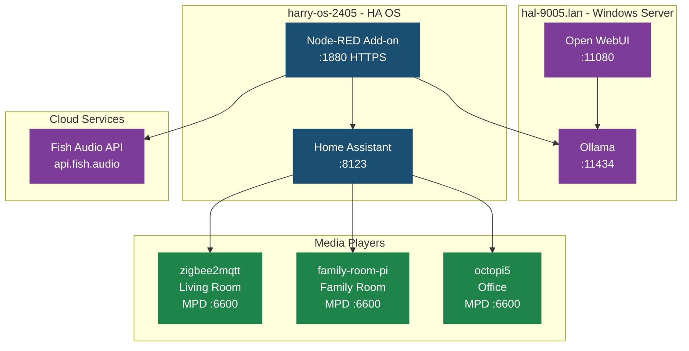

# Infrastructure

## Network Topology



## Servers

### hal-9005.lan (Windows)

- **Role**: AI inference server
- **GPU**: NVIDIA (used for Ollama)
- **Services**:
  - **Ollama** — `http://hal-9005.lan:11434` — LLM inference (gemma4, llama3.2, deepseek, etc.)
  - **Open WebUI** — `http://hal-9005.lan:11080` — Web UI for Ollama with custom model management
    - Auth: `admin@localhost` / `admin`

### harry-os-2405 (Home Assistant OS)

- **Role**: Home automation hub
- **Services**:
  - **Home Assistant** — `http://homeassistant.lan:8123` — Core automation
  - **Node-RED** — `https://harry-os-2405:1880` — Flow automation (HA add-on)
    - Behind nginx with SSL
    - `leave_front_door_open` enabled for API access during development
  - **Zigbee2MQTT**, **Z-Wave JS**, **ESPHome**, **Mosquitto** — device integrations

### Media Player Pis

| Hostname | IP | Area | OS | MPD | Audio Device | Notes |
|----------|------|------|------|-----|-------------|-------|
| zigbee2mqtt | 192.168.1.202 | Living Room | Raspbian Buster (10) | 0.21.5 | hw:0,0 (bcm2835) | Also runs Zigbee2MQTT. Has audio cutoff bug (needs silence padding). |
| family-room-pi | 192.168.1.x | Family Room | Debian Bookworm (12) | 0.23.x | hw:1,0 | Current OS, no audio issues. |
| octopi5 | 192.168.1.144 | Office | Debian Bookworm (12) | 0.23.x | hw:0,0 (USB Audio) | Also runs OctoPrint for 3D printer. |

## External Services

### Fish Audio

- **URL**: `https://api.fish.audio`
- **Plan**: Pay-as-you-go ($15 per million UTF-8 bytes)
- **Auth**: Bearer token (API key in `.env`)
- **Voice model**: `0d34211209014116ac7f82d4c4df035f` (Silly Connolly)
- **Endpoints used**:
  - `POST /v1/tts` — text-to-speech with cloned voice
  - `GET /model?self=true` — list own voice models

## File System Paths

### Node-RED Add-on Container

| Container Path | Maps To | Description |
|----------------|---------|-------------|
| `/homeassistant/` | HA `/config/` | Main HA config directory |
| `/homeassistant/www/` | HA `/config/www/` | Served at `http://ha:8123/local/` |
| `/config/` | Add-on config | Node-RED's own config (NOT HA's) |
| `/data/` | Add-on data | Persistent storage |

### Important Paths

| Path | Purpose |
|------|---------|
| `/homeassistant/www/tts/silly-connolly-quip.mp3` | Generated TTS audio |
| `/homeassistant/www/tts/silence-2s.mp3` | Pre-generated 2s silence for padding |

## MPD Configuration

All media players run MPD with ALSA output. Key config differences:

| Setting | zigbee2mqtt | family-room-pi | octopi5 |
|---------|-------------|-----------------|---------|
| OS | Buster (10) | Bookworm (12) | Bookworm (12) |
| MPD version | 0.21.5 | 0.23.x | 0.23.x |
| Device | `hw:0,0` | `hw:1,0` | `hw:0,0` |
| Bind | `any` | `0.0.0.0` | `0.0.0.0` |
| Port | 6600 | 6600 | 6600 |
| Audio cutoff | Yes (needs silence padding) | No | No |

### SSH Access

```bash
ssh zigbee2mqtt       # Living Room Pi
ssh family-room-pi    # Family Room Pi
ssh octopi5           # Office Pi
ssh -p 2222 root@harry-os-2405  # HA OS SSH add-on
```

All Pis have passwordless sudo.
