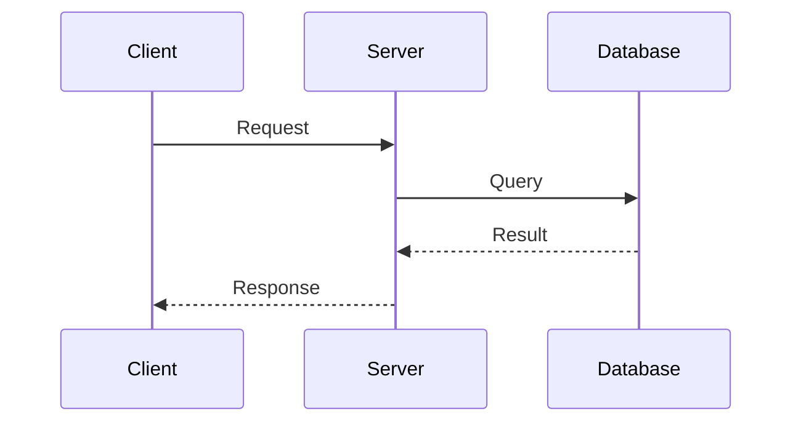
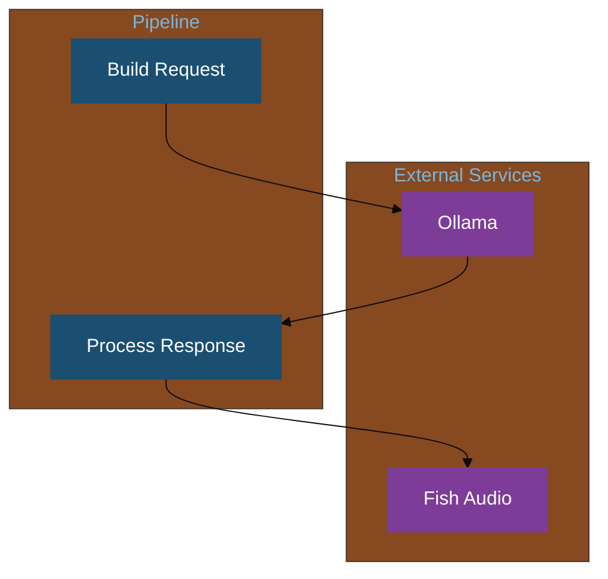

# Mermaid Style Guide

Standard colour scheme and styling for all mermaid diagrams in this project.

## Colour Palette

Inspired by Scottish tones — deep blues, warm ambers, and clean neutrals.

| Role | Hex | Usage |
|------|-----|-------|
| Primary | `#1B4F72` | Core pipeline nodes |
| Secondary | `#7D3C98` | External services (APIs, cloud) |
| Accent | `#D4AC0D` | Triggers, inputs, user actions |
| Success | `#1E8449` | Output, playback, completion |
| Neutral | `#5D6D7E` | Debug, logging, utility nodes |
| Warning | `#CA6F1E` | Error handling, fallbacks |
| Background | `#F8F9FA` | Subgraph backgrounds |

All colours use **white text** for readability.

## Flowchart Style


## Recommended Node Type Mapping

| Node Type | Class | Colour | Examples |
|-----------|-------|--------|----------|
| Input/Trigger | `accent` | Amber | Inject, HA events, manual triggers |
| Processing | `primary` | Deep Blue | Function nodes, data transforms |
| External API | `secondary` | Purple | Ollama, Fish Audio, HA API calls |
| Output/Action | `success` | Green | Play media, save file, announce |
| Debug/Utility | `neutral` | Grey | Debug nodes, logging |
| Error/Fallback | `warning` | Orange | Error handlers, fallbacks |

## Sequence Diagram Style

Use default styling. Keep participant names short and descriptive.



## Subgraph Style

Use subgraphs to group related nodes with the neutral background:



## Class Definition Snippet

Copy this block into any diagram that needs styled nodes:

```
    classDef primary fill:#1B4F72,stroke:#1B4F72,color:#fff
    classDef secondary fill:#7D3C98,stroke:#7D3C98,color:#fff
    classDef accent fill:#D4AC0D,stroke:#D4AC0D,color:#fff
    classDef success fill:#1E8449,stroke:#1E8449,color:#fff
    classDef neutral fill:#5D6D7E,stroke:#5D6D7E,color:#fff
    classDef warning fill:#CA6F1E,stroke:#CA6F1E,color:#fff
```

Apply to nodes with `:::className` suffix: `A[My Node]:::primary`
