# Node-RED Flows

All flows are stored in `silly-connolly/` and deployed via `python3 scripts/manage.py deploy-nodered`.

## Silly Connolly Subflow

**File**: `silly-connolly/silly-connolly-subannounce.json`

The reusable subflow that powers all Silly Connolly announcements. Any flow can drop in this node and wire `msg.prompt` + `msg.areas` to it.

### Inputs

| Property | Type | Required | Description |
|----------|------|----------|-------------|
| `msg.prompt` | string | Yes | What to quip about |
| `msg.areas` | string[] | No | Area names to announce on. Empty = all areas. Prefix with `x` to disable (e.g. `"xOffice"`) |
| `msg.announcement` | string | No | Backup plain-text announcement (reserved for future use) |

### Outputs

Single output with the result of the HA service call.

### Internal Nodes

```mermaid
flowchart LR
    subgraph Quip Generation
        BQ[Build Quip]:::primary --> OL[Ollama]:::secondary
        OL --> EQ[Extract Quip]:::primary
    end

    subgraph TTS
        EQ --> BT[Build TTS]:::primary
        BT --> FA[Fish Audio]:::secondary
        FA --> ST[Stash Audio]:::primary
        ST --> RS[Read Silence]:::primary
        RS --> CC[Concat]:::primary
        CC --> SV[Save MP3]:::primary
    end

    subgraph Announce
        SV --> RA[Resolve Areas]:::primary
        RA --> PL[Play Media]:::success
    end

    classDef primary fill:#1B4F72,stroke:#1B4F72,color:#fff
    classDef secondary fill:#7D3C98,stroke:#7D3C98,color:#fff
    classDef success fill:#1E8449,stroke:#1E8449,color:#fff
```



### Configuration

API keys and voice IDs are hardcoded in the function nodes:

- **Ollama URL**: `http://hal-9005.lan:11434/api/chat`
- **Fish Audio API Key**: In "Build TTS" node
- **Fish Audio Voice ID**: In "Build TTS" node
- **HA Server**: Node ID `625d9705.e710f8`

### Area Mapping

Defined in the "Resolve Areas → Players" function node:

| Area Name | Entities |
|-----------|----------|
| Living Room | `media_player.zigbee2mqtt` |
| Family Room | `media_player.family_room_tv`, `media_player.family_room_pi`, `media_player.family_room_chromecast` |
| Front Entry | `media_player.front_doorbell_speaker` |
| Guest Bedroom | `media_player.google_hub_office` |
| Office | `media_player.octopi5` |

---

## Silly Connolly Announce

**File**: `silly-connolly/silly-connolly-announce.json`

The original standalone flow with a manual trigger. Calls Ollama directly with the system prompt inlined, saves MP3 to HA, and plays on `media_player.zigbee2mqtt`.

This was the first working flow and is kept as a reference/fallback. The subflow above is the preferred approach for new integrations.

### Nodes

| Node | Type | Description |
|------|------|-------------|
| Manual Trigger | inject | Sends `msg.topic = "washing machine is done"` |
| Build Quip Request | function | Constructs Ollama API call with system prompt |
| Ollama Generate Quip | http request | POST to Ollama |
| Extract Quip Text | function | Pulls `message.content` from response |
| Build Fish Audio TTS | function | Constructs Fish Audio API call |
| Fish Audio TTS | http request | POST, returns binary MP3 |
| Save MP3 | file | Writes to `/homeassistant/www/tts/` |
| Build Announce | function | Constructs play_media payload |
| Play on Speaker | api-call-service | Calls HA `media_player.play_media` |

---

## Silly Connolly Test

**File**: `silly-connolly/silly-connolly-test.json`

Test flow with multiple inject triggers for different rooms. Uses the Silly Connolly Announce subflow.

### Triggers

| Button | Prompt | Areas |
|--------|--------|-------|
| Living Room | "washing machine is done" | `["Living Room"]` |
| Family Room | "dinner is ready" | `["Family Room"]` |
| Living + Family | "the dog needs to go outside" | `["Living Room", "Family Room"]` |
| Office | "stop working and take a break" | `["Office"]` |
| All Areas | "it's time for bed" | (none = all) |

---

## Deployment

Flows are deployed from the repo to Node-RED via the Admin API:

```bash
python3 scripts/manage.py deploy-nodered
```

This:
1. Downloads current flows from Node-RED
2. Replaces nodes belonging to our managed tabs/subflows
3. Preserves all other flows and their positions
4. Injects the HA server ID from `.env` into any unconfigured service nodes
5. Deploys the full flow set

The deploy is idempotent and preserves Silly Connolly instances that were added to other flows (e.g. by `replace-chatbot.py`).
