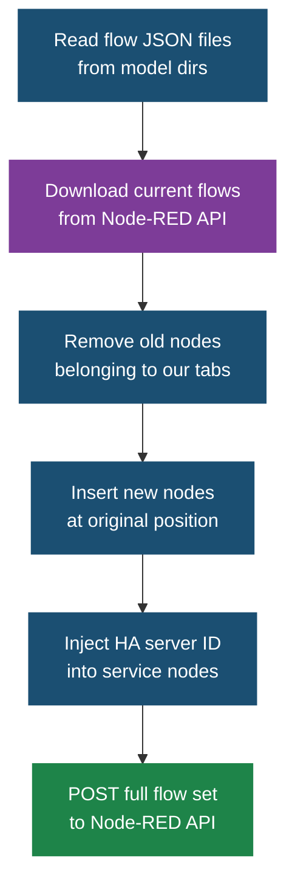
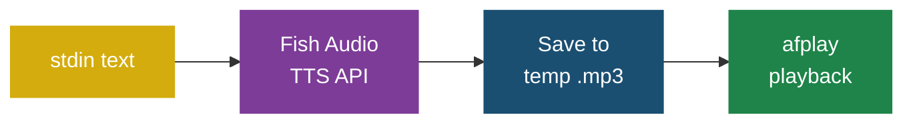

# Scripts

All scripts live in `scripts/` and should be run from the repo root.

## manage.py

Model and flow management CLI.

### Usage

```bash
# Open WebUI model management
python3 scripts/manage.py sync                    # Sync all models to Open WebUI
python3 scripts/manage.py sync silly-connolly     # Sync one model
python3 scripts/manage.py list                    # List remote custom models
python3 scripts/manage.py delete silly-connolly   # Delete a model
python3 scripts/manage.py chat silly-connolly     # Test chat with a model
python3 scripts/manage.py chat silly-connolly "quip about the BBQ"

# Node-RED deployment
python3 scripts/manage.py deploy-nodered          # Deploy all flows
```

### Configuration

Reads from `.env` in the repo root:

| Variable | Used By | Description |
|----------|---------|-------------|
| `OPENWEBUI_URL` | sync/list/delete/chat | Open WebUI URL (default: `http://hal-9005.lan:11080`) |
| `OPENWEBUI_EMAIL` | sync/list/delete/chat | Login email (default: `admin@localhost`) |
| `OPENWEBUI_PASS` | sync/list/delete/chat | Login password (default: `admin`) |
| `NODERED_URL` | deploy-nodered | Node-RED URL (default: `https://harry-os-2405:1880`) |
| `NODERED_HA_SERVER_ID` | deploy-nodered | HA server config node ID to inject into service nodes |

### How deploy-nodered Works



Key behaviours:
- Only removes nodes whose parent (`z`) is a managed tab/subflow
- Does NOT remove Silly Connolly instances in other flows
- Preserves flow tab ordering

### Model Discovery

Models are discovered by scanning `*/model.yaml` files in the repo root. Each YAML file defines:

```yaml
id: silly-connolly
name: Silly Connolly
base_model_id: gemma4:latest
meta:
  description: ...
  tags: [comedy, scottish]
params:
  temperature: 0.9
  system: |
    System prompt here...
```

---

## silly-connolly-tts.py

Local TTS testing script. Reads text from stdin, sends to Fish Audio, plays back the audio.

### Usage

```bash
# Simple test
echo "The washing machine is done" | python3 silly-connolly/scripts/silly-connolly-tts.py

# Pipe from model chat
python3 scripts/manage.py chat silly-connolly "quip about dinner" \
  | python3 silly-connolly/scripts/silly-connolly-tts.py

# List voices
python3 silly-connolly/scripts/silly-connolly-tts.py --voices

# Show voice details
python3 silly-connolly/scripts/silly-connolly-tts.py --voice-info
```

### How It Works



### Configuration

Reads from `.env`:

| Variable | Description |
|----------|-------------|
| `FISH_AUDIO_API_KEY` | Fish Audio API key |
| `FISH_AUDIO_VOICE_ID` | Voice model ID (auto-detected if only one voice exists) |

### Caching

Voice listing and info are cached to `tmp/fish.audio/`:

- `tmp/fish.audio/models.json` — all voices
- `tmp/fish.audio/model-{id}.json` — individual voice details

---

## replace-chatbot.py

One-time migration script that replaced all "ChatBot Announcer" subflow instances with "Silly Connolly Announce" instances across Node-RED.

### What It Does

1. Downloads all flows from Node-RED
2. For each ChatBot Announcer instance:
   - Disables the old instance (`"d": true`)
   - Adds `msg.areas` rule to the feeding change node (with friendly area names)
   - Creates a new Silly Connolly subflow instance
   - Wires it to the same inputs and outputs
3. Deploys the updated flows

### Idempotent

Safe to re-run. It removes any existing Silly Connolly replacement nodes before adding new ones, and skips areas rules that already exist.

### Usage

```bash
python3 silly-connolly/scripts/replace-chatbot.py
```

### Area Mapping

| Old (ChatBot) | New (Silly Connolly) |
|---------------|---------------------|
| `office` | `Office` |
| `living_room` | `Living Room` |
| `family_room` | `Family Room` |
| `guest_bedroom` | `Guest Bedroom` |
| `x`-prefixed | Skipped (disabled) |
