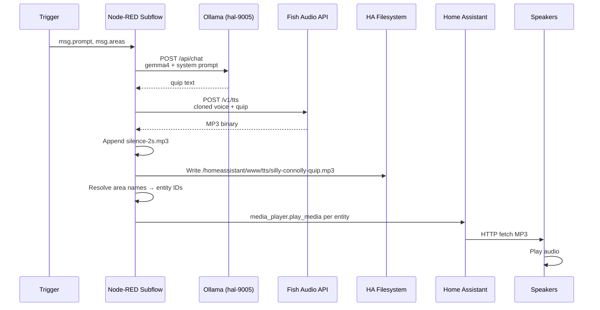
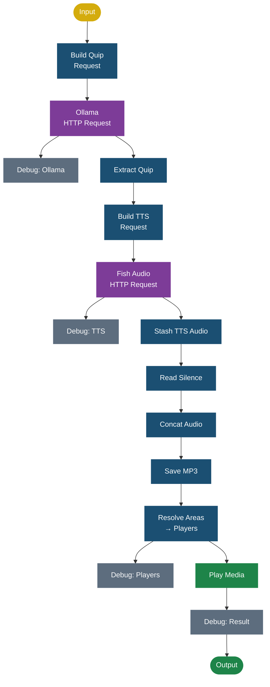

# Silly Connolly Architecture

## Overview

Silly Connolly is an end-to-end pipeline that generates comedic announcements in the style of [Billy Connolly](https://en.wikipedia.org/wiki/Billy_Connolly) and plays them on speakers throughout the house via Home Assistant.

## Pipeline

## Detailed Data Flow

## Components

### 1. Trigger (Node-RED)

Any Node-RED node can trigger an announcement by sending a message with:

- `msg.prompt` — what to quip about (e.g. `"the washing machine is done"`)
- `msg.areas` — array of area names (e.g. `["Living Room", "Office"]`), empty = all areas
- `msg.announcement` — (optional) backup plain-text announcement for fallback

Area names support an `x` prefix convention for disabling individual areas during testing (e.g. `"xOffice"` skips Office).

### 2. Ollama LLM (gemma4:latest)

The quip is generated by calling `POST http://hal-9005.lan:11434/api/chat` with:

- **Model**: `gemma4:latest`
- **System prompt**: Silly Connolly persona — working-class Glaswegian comedian
- **User message**: `"Give me a quip about the " + msg.prompt`
- **Temperature**: 0.9 (high creativity)
- **Stream**: false (wait for complete response)

The system prompt enforces:
- 1-2 sentences max for TTS mode
- No formatting, quotes, stage directions, or preamble
- Scottish words and phrases in standard spelling (never phonetic)
- Natural profanity as authentic working-class speech

### 3. Fish Audio TTS

Text-to-speech using a cloned Billy Connolly voice:

- **API**: `POST https://api.fish.audio/v1/tts`
- **Model**: `s2-pro`
- **Voice**: Cloned from 90 seconds of Royal Albert Hall (1987) audio
- **Output**: MP3 binary stream
- **Voice ID**: `0d34211209014116ac7f82d4c4df035f`

### 4. Silence Padding

Older MPD instances (e.g. zigbee2mqtt running MPD 0.21.5 on Raspbian Buster) cut off the last ~0.5s of audio because the ALSA output closes before the buffer fully drains.

Fix: A pre-generated `silence-2s.mp3` file is read from `/homeassistant/www/tts/` and appended to the TTS output using `Buffer.concat()`. This ensures the last word is fully played before MPD closes the output.

### 5. File Storage

The combined MP3 (TTS + silence) is saved to `/homeassistant/www/tts/silly-connolly-quip.mp3`, which maps to HA's `/config/www/tts/` and is served at `http://homeassistant.lan:8123/local/tts/silly-connolly-quip.mp3`.

Files in `/local/` are served without authentication, which is required because media players fetch the audio directly.

### 6. Area Resolution

The subflow resolves friendly area names to `media_player` entity IDs using a hardcoded mapping:

| Area | Media Players |
|------|--------------|
| Living Room | `media_player.zigbee2mqtt` |
| Family Room | `media_player.family_room_pi` |
| Office | `media_player.google_hub_office`, `media_player.octopi5` |

### 7. Media Playback

For each resolved media player, the subflow calls HA's `media_player.play_media` service with the MP3 URL and entity ID.

## Integration Points

The Silly Connolly subflow replaced the previous "ChatBot Announcer" in 7 flows:

| Flow | Trigger | Prompt Type |
|------|---------|-------------|
| WLED Preset/Effect | WLED config failure | Dynamic (device name + failure type) |
| Sprocket | Button press spam | Static |
| Announcers (door) | Door open/close event | Dynamic (door name + state) |
| Announcers (leak) | Leak sensor triggered | Dynamic (sensor name + leak state) |
| Laundry Room | Washer/dryer done | Dynamic (machine name) |
| Prusa Mini | Print cancel success/fail | Static |
| BBQ | BBQ cooking event | Dynamic (meat type) |

## Subflow Internal Structure

## Message Properties

| Stage | Property | Description |
|-------|----------|-------------|
| Input | `msg.prompt` | What to quip about |
| Input | `msg.areas` | Array of area names (empty = all) |
| Input | `msg.announcement` | Optional plain-text fallback |
| Internal | `msg._prompt` | Stashed prompt |
| Internal | `msg._areas` | Stashed areas |
| Internal | `msg.quip` | Generated quip text from Ollama |
| Internal | `msg._ttsAudio` | TTS binary before silence concat |
| Output | `msg.payload.data.media_content_id` | MP3 URL |
| Output | `msg.payload.data.entity_id` | Target media player |
