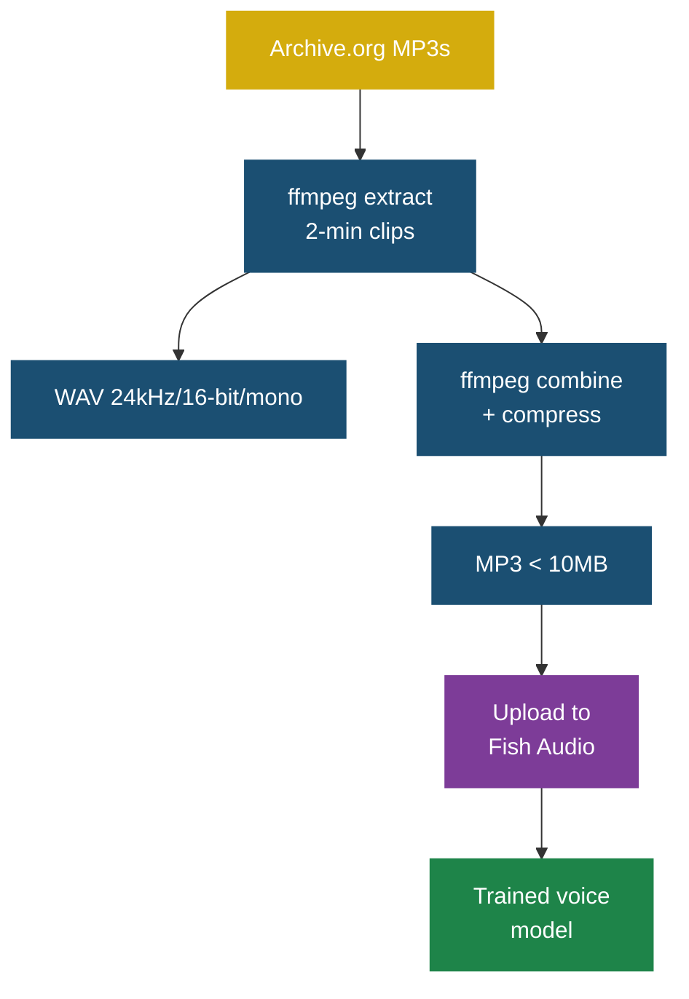

# Voice Cloning

The Silly Connolly voice is cloned using [Fish Audio](https://fish.audio) from recordings of Billy Connolly's stand-up comedy.

## Voice Source

**Album**: Billy and Albert: Billy Connolly at the Royal Albert Hall (1987)
**Source**: [Archive.org](https://archive.org/details/billy-and-albert-billy-connolly-at-the-royal-albert-hall)

### Raw Downloads

Stored in `silly-connolly/voice-samples/raw/`:

| Track | Title | Duration |
|-------|-------|----------|
| 01 | President of America | 2:20 |
| 04 | Edinburgh Festival | 3:37 |
| 07 | Nuclear Weapons | 2:48 |
| 10 | Hotel Room in Perth | 2:57 |
| 11 | Condoms | 7:13 |
| 14 | Visiting Scotland | 1:14 |
| 15 | Wee Brown Dogs | 3:43 |
| 19 | Something Has to Give | 3:05 |

### Processed Samples

Stored in `silly-connolly/voice-samples/`:

**2-minute clips** (24kHz, 16-bit, mono WAV) — used for detailed voice analysis:
- `sample-01-edinburgh-festival.wav`
- `sample-02-nuclear-weapons.wav`
- `sample-03-hotel-room-perth.wav`
- `sample-04-condoms.wav`
- `sample-05-wee-brown-dogs.wav`
- `sample-06-something-has-to-give.wav`

**Upload files** for Fish Audio:
- `silly-connolly-90s.mp3` — 90 second clip from "Hotel Room in Perth" (cleanest speech, zero audience laughter gaps)
- `silly-connolly-combined.mp3` — all 6 clips combined (8.2MB)
- `silly-connolly-combined2.mp3` — combined at lower bitrate (4.8MB)

## Fish Audio Voice

- **Voice ID**: `0d34211209014116ac7f82d4c4df035f`
- **Name**: Silly Connolly
- **Model**: s2-pro
- **State**: Trained
- **Upload file used**: `silly-connolly-90s.mp3`

### Quality Notes

Fish Audio flagged the audio as "multi speaker" due to audience noise in the background. Despite this, the voice clone quality is good for short quips.

For best results:
- Keep quips to 1-2 sentences
- Avoid very long pauses in the text
- The voice works best with conversational, informal text

## How to Update the Voice

### Re-upload with better samples

1. Extract cleaner audio clips using ffmpeg:
   ```bash
   ffmpeg -y -i "raw/10 Hotel Room in Perth.mp3" -ss 5 -t 90 \
     -ar 24000 -ac 1 -b:a 96k silly-connolly-90s.mp3
   ```

2. Upload to Fish Audio:
   ```bash
   python3 silly-connolly/scripts/silly-connolly-tts.py --voices  # list current voices
   ```
   Then upload via the [Fish Audio web UI](https://fish.audio).

3. Update `FISH_AUDIO_VOICE_ID` in `.env` and in the Node-RED subflow's "Build TTS" function node.

### Finding clean speech segments

Use silence detection to find segments with continuous speech (no audience laughter):

```bash
for start in $(seq 5 30 400); do
  gaps=$(ffmpeg -i "raw/11 Condoms.mp3" -ss $start -t 90 \
    -af "silencedetect=noise=-35dB:d=0.5" -f null /dev/null 2>&1 \
    | grep -c "silence_start")
  [ "$gaps" -le 5 ] && echo "${start}s: $gaps gaps (CLEAN)"
done
```

## Processing Pipeline


